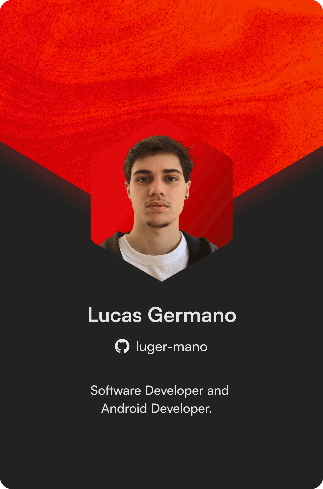

<header>
  <h2 align="center">👋 E aí, eu sou o Lucas!</h2>
</header>

<main>
  

    

      

        

          <picture id="linux">
            <source media="(prefers-color-scheme: light)" srcset="https://img.shields.io/badge/-Linux-F5F5F5?style=flat&logo=linux">
            <source media="(prefers-color-scheme: dark)" srcset="https://img.shields.io/badge/-Linux-05122A?style=flat&logo=linux">
            
          </picture>
          <picture id="java">
                <source media="(prefers-color-scheme: light)" srcset="https://img.shields.io/badge/-Java-F5F5F5?style=flat&logo=openjdk">
                <source media="(prefers-color-scheme: dark)" srcset="https://img.shields.io/badge/-Java-05122A?style=flat&logo=openjdk">
                
            </picture>
            <picture id="spring-boot">
                <source media="(prefers-color-scheme: light)" srcset="https://img.shields.io/badge/-Spring%20Boot-F5F5F5?style=flat&logo=springboot">
                <source media="(prefers-color-scheme: dark)" srcset="https://img.shields.io/badge/-Spring%20Boot-05122A?style=flat&logo=springboot">
                
            </picture>
            <picture id="junit5">
                <source media="(prefers-color-scheme: light)" srcset="https://img.shields.io/badge/-JUnit5-F5F5F5?style=flat&logo=junit5">
                <source media="(prefers-color-scheme: dark)" srcset="https://img.shields.io/badge/-JUnit5-05122A?style=flat&logo=junit5">
                
            </picture>
            <picture id="hibernate">
                <source media="(prefers-color-scheme: light)" srcset="https://img.shields.io/badge/-Hibernate-F5F5F5?style=flat&logo=hibernate">
                <source media="(prefers-color-scheme: dark)" srcset="https://img.shields.io/badge/-Hibernate-05122A?style=flat&logo=hibernate">
                
            </picture>
            <picture id="git">
                <source media="(prefers-color-scheme: light)" srcset="https://img.shields.io/badge/-Git-F5F5F5?style=flat&logo=git">
                <source media="(prefers-color-scheme: dark)" srcset="https://img.shields.io/badge/-Git-05122A?style=flat&logo=git">
                
            </picture>
            <picture id="bash">
                <source media="(prefers-color-scheme: light)" srcset="https://img.shields.io/badge/-Bash-F5F5F5?style=flat&logo=gnu-bash">
                <source media="(prefers-color-scheme: dark)" srcset="https://img.shields.io/badge/-Bash-05122A?style=flat&logo=gnu-bash">
                
            </picture>
            <picture id="docker">
                <source media="(prefers-color-scheme: light)" srcset="https://img.shields.io/badge/-Docker-F5F5F5?style=flat&logo=docker">
                <source media="(prefers-color-scheme: dark)" srcset="https://img.shields.io/badge/-Docker-05122A?style=flat&logo=docker">
                
            </picture>
            <picture id="mongo">
                <source media="(prefers-color-scheme: light)" srcset="https://img.shields.io/badge/-MongoDB-F5F5F5?style=flat&logo=MongoDB">
                <source media="(prefers-color-scheme: dark)" srcset="https://img.shields.io/badge/-MongoDB-05122A?style=flat&logo=MongoDB">
                
            </picture>
            <picture id="mysql">
                <source media="(prefers-color-scheme: light)" srcset="https://img.shields.io/badge/-MySQL-F5F5F5?style=flat&logo=mysql">
                <source media="(prefers-color-scheme: dark)" srcset="https://img.shields.io/badge/-MySQL-05122A?style=flat&logo=mysql">
                
            </picture>
            <picture id="openai">
                <source media="(prefers-color-scheme: light)" srcset="https://img.shields.io/badge/-OpenAI-F5F5F5?style=flat&logo=openai">
                <source media="(prefers-color-scheme: dark)" srcset="https://img.shields.io/badge/-OpenAI-05122A?style=flat&logo=openai">
                
            </picture>
            <picture id="python">
                <source media="(prefers-color-scheme: light)" srcset="https://img.shields.io/badge/-Python-F5F5F5?style=flat&logo=python">
                <source media="(prefers-color-scheme: dark)" srcset="https://img.shields.io/badge/-Python-05122A?style=flat&logo=python">
                
            </picture>
            <picture id="postman">
                <source media="(prefers-color-scheme: light)" srcset="https://img.shields.io/badge/-Postman-F5F5F5?style=flat&logo=postman&logoColor=FF6C37">
                <source media="(prefers-color-scheme: dark)" srcset="https://img.shields.io/badge/-Postman-05122A?style=flat&logo=postman&logoColor=FF6C37">
                
            </picture>
            <picture id="kafka">
                <source media="(prefers-color-scheme: light)" srcset="https://img.shields.io/badge/-Kafka-F5F5F5?style=flat&logo=apachekafka">
                <source media="(prefers-color-scheme: dark)" srcset="https://img.shields.io/badge/-Kafka-05122A?style=flat&logo=apachekafka">
                
            </picture>
            <picture id="auth0">
                <source media="(prefers-color-scheme: light)" srcset="https://img.shields.io/badge/-Auth0-F5F5F5?style=flat&logo=auth0&logoColor=EB5424">
                <source media="(prefers-color-scheme: dark)" srcset="https://img.shields.io/badge/-Auth0-05122A?style=flat&logo=auth0&logoColor=EB5424">
                
            </picture>
            <picture id="amazon-web-service">
                <source media="(prefers-color-scheme: light)" srcset="https://img.shields.io/badge/-AWS-F5F5F5?style=flat&logo=amazon-aws&logoColor=yellow">
                <source media="(prefers-color-scheme: dark)" srcset="https://img.shields.io/badge/-AWS-05122A?style=flat&logo=amazon-aws&logoColor=yellow">
                
            </picture>
            <picture id="github-actions">
                <source media="(prefers-color-scheme: light)" srcset="https://img.shields.io/badge/-Github%20Actions-F5F5F5?style=flat&logo=githubactions">
                <source media="(prefers-color-scheme: dark)" srcset="https://img.shields.io/badge/-Github%20Actions-05122A?style=flat&logo=githubactions">
                
            </picture>
            <picture id="apache">
                <source media="(prefers-color-scheme: light)" srcset="https://img.shields.io/badge/-Apache-F5F5F5?style=flat&logo=apache&logoColor=black">
                <source media="(prefers-color-scheme: dark)" srcset="https://img.shields.io/badge/-Apache-05122A?style=flat&logo=apache">
                
            </picture>
            <picture id=".net">
                <source media="(prefers-color-scheme: light)" srcset="https://img.shields.io/badge/--F5F5F5?style=flat&logo=dotnet&logoColor=512BD4">
                <source media="(prefers-color-scheme: dark)" srcset="https://img.shields.io/badge/--05122A?style=flat&logo=dotnet&logoColor=512BD4">
                
            </picture>
            <picture id="kotlin">
                <source media="(prefers-color-scheme: light)" srcset="https://img.shields.io/badge/-Kotlin-F5F5F5?style=flat&logo=kotlin">
                <source media="(prefers-color-scheme: dark)" srcset="https://img.shields.io/badge/-Kotlin-05122A?style=flat&logo=kotlin">
                
            </picture>
            <picture id="redis">
                <source media="(prefers-color-scheme: light)" srcset="https://img.shields.io/badge/-Redis-F5F5F5?style=flat&logo=redis">
                <source media="(prefers-color-scheme: dark)" srcset="https://img.shields.io/badge/-Redis-05122A?style=flat&logo=redis">
                
            </picture>
            <picture id="node.js">
                <source media="(prefers-color-scheme: light)" srcset="https://img.shields.io/badge/-Node.Js-F5F5F5?style=flat&logo=nodedotjs">
                <source media="(prefers-color-scheme: dark)" srcset="https://img.shields.io/badge/-Node.Js-05122A?style=flat&logo=nodedotjs">
                
            </picture>
            <picture id="javascript">
                <source media="(prefers-color-scheme: light)" srcset="https://img.shields.io/badge/-JavaScript-F5F5F5?style=flat&logo=javascript">
                <source media="(prefers-color-scheme: dark)" srcset="https://img.shields.io/badge/-JavaScript-05122A?style=flat&logo=javascript">
                
            </picture>
        

      

       
      

        <h3 id="title">🤔 Um pouco sobre mim...</h3>
        <ul id="list">
          <li>💼 Estou em busca de uma nova oportunidade.</li>
          <li>🚀 Quer construir um sistema comigo? <a href="https://www.linkedin.com/in/lucas-germano-dev/">entre em contato</a>.</li>
          <li>📂 Meu Portfólio e Currículo <a href="https://drive.google.com/drive/folders/1xWBApt-a2NfeCr_H8gF2lfoFk07YKJQD?usp=sharing">por aqui</a>.</li>
          <li>🌙 Um dos criadores do <strong>Luna</strong> <a href="https://github.com/LunaLPWI">repositório</a>.</li>
          <li>💬 Pergunte o que quiser <strong>Java, Spring Boot, Docker, AWS, integração de APIs, arquitetura limpa e boas práticas no backend</strong>.</li>
        </ul>
      

    

    <!-- DIREITA: SUA IMAGEM -->
    

      <picture>
        <source media="(prefers-color-scheme: dark)" srcset="./imagens/profile-card.png">
        <source media="(prefers-color-scheme: light)" srcset="./imagens/profile-card.png">
        
      </picture>
    

  

</main>

<footer>
  

    <a id="linkedin" href="https://www.linkedin.com/in/lucas-germano-dev/" target="_blank">
      <picture>
        <source media="(prefers-color-scheme: light)" srcset="https://gist.githubusercontent.com/stephan-lopes/df6b5fbbf5e055bff234b91678b1c421/raw/0be42bce20156533ac0a183187cb8a962db2a664/linkedin-dark.svg">
        <source media="(prefers-color-scheme: dark)" srcset="https://gist.githubusercontent.com/stephan-lopes/df6b5fbbf5e055bff234b91678b1c421/raw/58b820ea7cc3f7f05e585645b271bd7f13757327/linkedin.svg">
        
      </picture>
    </a>
    <a id="github" href="https://github.com/luger-mano" target="_blank">
      <picture>
        <source media="(prefers-color-scheme: light)" srcset="https://img.shields.io/badge/-GitHub-F5F5F5?style=flat&logo=github&logoColor=black">
        <source media="(prefers-color-scheme: dark)" srcset="https://img.shields.io/badge/-GitHub-05122A?style=flat&logo=github">
        
      </picture>
    </a>
  

</footer>
